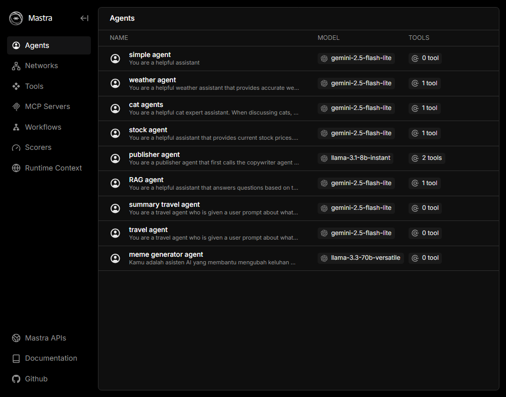

# 🧠 Building AI Agents 101 (Mastra + Vercel AI SDK)

Build AI agents in a simple way by learning through examples (more agents coming soon)



### What you'll learn:
- Build simple AI agents using Mastra
- Create and integrate custom tools into agents
- Use RAG (Retrieval-Augmented Generation) as tool in agents
- What is the complex workflow like
- Build Multi-Agent Workflow
- Deploying agents to production using Mastra Cloud

---

## 🧰 Prerequisites
- Node.js v20.0 atau lebih tinggi
- pnpm (install via `npm install -g pnpm`)  
- API key from a model provider (e.g., Groq or Gemini)
- Postgresql database (for rag)

---

## 📦 Getting started

Start development:

```bash
git clone https://github.com/wahyudesu/building-ai-agents-101.git
cd building-ai-agents-101
pnpm i
```

Create your .env file:

```bash
# Fill in the required API keys and database URL.
cp .env.example .env
```

```
pnpm dev
```

Check di http://localhost:4111/agents
Access swagger-ui http://localhost:4111/swagger-ui

## Upsert data before running RAG Agents 
```
npx tsx src/mastra/rag.ts
```

## Deploy to production
- publish to github as fork
- go to https://mastra.ai/cloud and login using github
- select repo and deploy

[Read more...](https://mastra.ai/en/docs/deployment/overview)


---

## Why Mastra 
Mastra is the easiest way to build a production AI application, built by the team that brought you Gatsby. We provide a complete set of AI primitives: workflows for complex operations, agents for autonomous decisions, RAG for knowledge integration, and evals for quality & accuracy. Mastra is open-source, modular, and built in Typescript for product developers. You can deploy Mastra on any cloud, and it gives you a straightforward syntax to solve the hardest problems building with AI: human-in-the-loop workflows, agent memory and tool selection, and output quality.